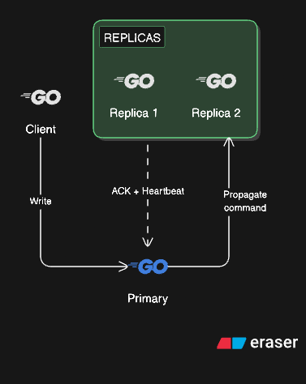

# ValkeyDB

A high-performance, Redis-compatible in-memory database built from scratch in Go.

## Key Features

- **RESP Protocol Compliant**: Fully compatible with redis-cli and other Redis clients
- **Multiple Data Structures**:
  - Dictionary (String key-value pairs)
  - Sets (Unique collections)
  - Lists (Deque semantics)
  - Hashes (Field-value maps)
  - Sorted Sets (Score-based ordering using Skip List)
  - Pub/Sub (Message broadcasting)
- **Memory Eviction**: Configurable eviction strategies (LRU, LFU, EvictFirst)
- **Dual Persistence**: AOF and RDB support
- **TTL Support**: Automatic key expiration

## Getting Started

```bash
git clone https://github.com/william1nguyen/valkeydb.git
cd valkeydb
make build
make run
```

Connect with redis-cli:

```bash
redis-cli -p 6379
127.0.0.1:6379> PING
PONG
127.0.0.1:6379> SET mykey "Hello"
OK
127.0.0.1:6379> GET mykey
"Hello"
```

## Supported Commands

| Category    | Commands                                              |
| ----------- | ----------------------------------------------------- |
| String      | SET, GET, DEL, TTL, EXPIRE, PING                      |
| Sorted Set  | ZADD, ZREM, ZSCORE, ZRANK, ZCARD, ZRANGE              |
| Set         | SADD, SREM, SCARD, SMEMBERS, SISMEMBER, SEXPIRE, STTL |
| List        | LPUSH, RPUSH, LPOP, RPOP, LLEN, LRANGE, SORT          |
| Hash        | HSET, HGET, HDEL, HGETALL, HEXISTS, HLEN              |
| Pub/Sub     | SUBSCRIBE, UNSUBSCRIBE, PUBLISH                       |
| Transaction | MULTI, EXEC, DISCARD, WATCH, UNWATCH                  |
| System      | AUTH, INFO, BGSAVE, KEYS, MONITOR                     |

## Transactions

ValkeyDB supports atomic transactions via `MULTI/EXEC` with optimistic locking via `WATCH`.

**Basic transaction:**

```bash
127.0.0.1:6379> MULTI
OK
127.0.0.1:6379> SET counter 1
QUEUED
127.0.0.1:6379> SET name "alice"
QUEUED
127.0.0.1:6379> EXEC
1) OK
2) OK
```

**Optimistic locking with WATCH:**

```bash
127.0.0.1:6379> WATCH balance
OK
127.0.0.1:6379> MULTI
OK
127.0.0.1:6379> SET balance 100
QUEUED
127.0.0.1:6379> EXEC
(nil)   # returns nil if a watched key was modified before EXEC
```

| Command   | Description                                                   |
| --------- | ------------------------------------------------------------- |
| `MULTI`   | Start a transaction block                                     |
| `EXEC`    | Execute all queued commands atomically                        |
| `DISCARD` | Discard all queued commands and exit the transaction          |
| `WATCH`   | Watch keys; abort transaction if any key changes before EXEC  |
| `UNWATCH` | Unwatch all watched keys                                      |

## Replication

ValkeyDB supports primary-replica replication. Start a primary normally, then connect replicas using the API key printed at startup.

**Start primary:**

```bash
make run
# Server API key: <api-key>
```

**Start replica:**

```bash
make replica ADDRESS=<primary-addr> APIKEY=<api-key>
# e.g. make replica ADDRESS=localhost:6379 APIKEY=abc123
```



On connect, the replica performs a **full sync** (RDB snapshot) or **partial sync** (backlog delta on reconnect). Write commands are then streamed in real-time with heartbeat/ACK for liveness tracking.

## Configuration

Edit `config.yaml`:

```yaml
server:
  addr: ":6379"
  read_timeout: 300
  write_timeout: 300
  auth: secretpassword

replication:
  backlog_size: 1048576
  heartbeat_interval: 1
  heartbeat_timeout: 5

persistence:
  aof:
    enabled: true
    filename: "appendonly.aof"
    rewrite_interval: 3600
    max_size_mb: 64
  rdb:
    enabled: true
    filename: "dump.rdb"

datastructure:
  expiration:
    max_sample_size: 20
    max_sample_rounds: 3
    check_interval: 1

memory:
  key_limit: 5000000     # unlimited if not set
  evict_strategy: "lru"  # lru, lfu, evict_first

logging:
  level: "info"
  verbose_persistence: true
```

### Memory Eviction

When `key_limit` is exceeded, keys are evicted based on `evict_strategy`:

| Strategy        | Behavior                               |
| --------------- | -------------------------------------- |
| `lru`         | Evict least recently accessed key      |
| `lfu`         | Evict key with lowest access frequency |
| `evict_first` | Evict earliest inserted key            |

## Architecture

```
valkeydb/
├── cmd/valkeydb/          # Entry point
├── core/
│   ├── storage/           # Pure data structures
│   └── store/             # Store interface
├── command/               # Self-registering commands
├── protocol/              # RESP protocol
├── persistence/           # AOF/RDB
├── server/                # TCP server
└── config/                # Configuration
```

## Docker

```bash
docker build -t valkeydb:latest .
docker run --rm -p 6379:6379 valkeydb:latest
```

## TODO

- [X] RESP protocol
- [X] Dictionary, Set, List, Hash
- [X] Sorted Sets (ZADD, ZRANGE, ZRANK)
- [X] AOF and RDB persistence
- [X] TTL and key expiration
- [X] Memory eviction (LRU/LFU)
- [X] Transaction support (MULTI/EXEC)
- [X] Replication (primary-replica)
- [ ] Cluster mode
