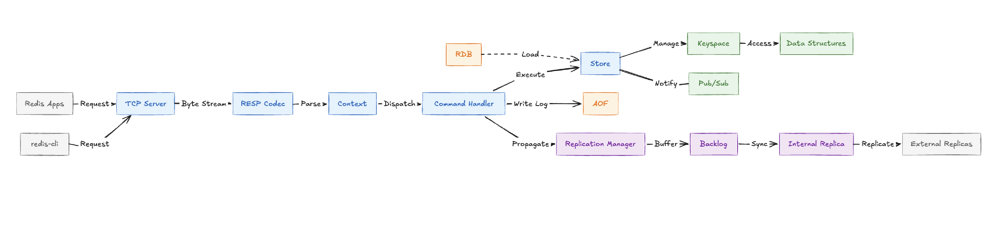
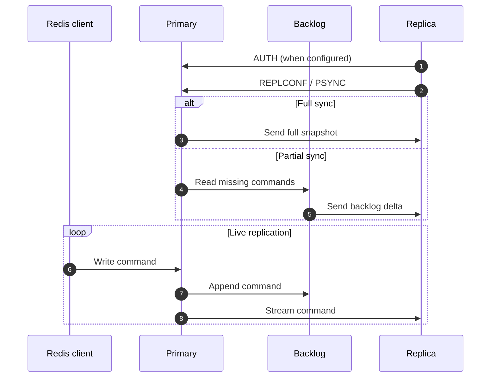

# ValkeyDB

A Redis-compatible learning database built from scratch in Go.

## Key Features

- **RESP2 Protocol**: Supports redis-cli and Redis clients for the implemented command set
- **Multiple Data Structures**:
  - Dictionary (String key-value pairs)
  - Sets (Unique collections)
  - Lists (Deque semantics)
  - Hashes (Field-value maps)
  - Sorted Sets (Score map with deterministic sorted slice ordering)
- **Memory Eviction**: Optional LRU eviction
- **Persistence**: WAL and versioned, checksummed snapshots
- **TTL Support**: Automatic key expiration

## System Architecture



## Getting Started

```bash
git clone https://github.com/william1nguyen/valkeydb.git
cd valkeydb
make build
make run
```

Connect with redis-cli:

```bash
redis-cli -p 6379
127.0.0.1:6379> PING
PONG
127.0.0.1:6379> SET mykey "Hello"
OK
127.0.0.1:6379> GET mykey
"Hello"
```

## Supported Commands

| Category    | Commands                                              |
| ----------- | ----------------------------------------------------- |
| String      | SET, GET, DEL, TTL, EXPIRE, PING                      |
| Sorted Set  | ZADD, ZREM, ZSCORE, ZRANK, ZCARD, ZRANGE              |
| Set         | SADD, SREM, SCARD, SMEMBERS, SISMEMBER                 |
| List        | LPUSH, RPUSH, LPOP, RPOP, LLEN, LRANGE                 |
| Hash        | HSET, HGET, HDEL, HGETALL, HEXISTS, HLEN              |
| Transaction | MULTI, EXEC, DISCARD, WATCH, UNWATCH                  |
| System      | AUTH, INFO, KEYS                                      |

## Transactions

ValkeyDB supports atomic transactions via `MULTI/EXEC` with optimistic locking via `WATCH`.

**Basic transaction:**

```bash
127.0.0.1:6379> MULTI
OK
127.0.0.1:6379> SET counter 1
QUEUED
127.0.0.1:6379> SET name "alice"
QUEUED
127.0.0.1:6379> EXEC
1) OK
2) OK
```

**Optimistic locking with WATCH:**

```bash
127.0.0.1:6379> WATCH balance
OK
127.0.0.1:6379> MULTI
OK
127.0.0.1:6379> SET balance 100
QUEUED
127.0.0.1:6379> EXEC
(nil)   # returns nil if a watched key was modified before EXEC
```

| Command   | Description                                                   |
| --------- | ------------------------------------------------------------- |
| `MULTI`   | Start a transaction block                                     |
| `EXEC`    | Execute all queued commands atomically                        |
| `DISCARD` | Discard all queued commands and exit the transaction          |
| `WATCH`   | Watch keys; abort transaction if any key changes before EXEC  |
| `UNWATCH` | Unwatch all watched keys                                      |

## Replication

ValkeyDB follows the Redis OSS model: every primary and replica is an independent process. A replica declares its primary in its own configuration and connects automatically at startup.

**Start primary:**

```bash
make run
```

**Start replica:**

```bash
make replica
# Uses config.replica.yaml by default.
```

To run more replicas, copy `config.replica.yaml` and give every process a unique `server.addr`, WAL filename, and snapshot filename. The primary neither creates replica processes nor owns a replica-count setting.



On connect, the replica performs a **full sync** or **partial sync** from the backlog on reconnect. Write commands are then streamed in real time; TCP errors remove disconnected replicas and trigger reconnects.

## Configuration

Edit `config.yaml`:

```yaml
server:
  addr: ":6379"
  read_timeout: 300
  write_timeout: 300
  auth: secretpassword

replication:
  role: "primary"       # primary or replica
  primary_addr: ""      # required on a replica
  username: ""          # optional; only the default user is currently supported
  password: ""          # primary server auth password, when required
  backlog_size: 1048576

persistence:
  wal:
    enabled: true
    filename: "valkeydb.wal"
    rewrite_interval: 3600
    max_size_mb: 64
  snapshot:
    enabled: false
    filename: "dump.vksp"

datastructure:
  expiration:
    check_interval: 1

memory:
  key_limit: 5000000     # unlimited if not set
  evict_strategy: "lru"  # empty or lru

logging:
  level: "info"
  verbose_persistence: true
```

When WAL and disk snapshots are enabled together, recovery restores the snapshot and replays the WAL suffix after its included byte offset. Automatic WAL rewrite is disabled in this mode so offsets never change underneath an existing snapshot. Full replication sync uses the same snapshot codec.

For an authenticated primary, the replica's `replication.password` must match the primary's `server.auth`. `replication.username` may be empty or `default`; custom ACL users are not implemented yet.

### Memory Eviction

When `key_limit` is exceeded and `evict_strategy` is `lru`, the least recently used key is evicted.

| Strategy | Behavior                          |
| -------- | --------------------------------- |
| `lru`    | Evict least recently accessed key |

## Docker

```bash
docker build -t valkeydb:latest .
docker run --rm -p 6379:6379 valkeydb:latest
```
