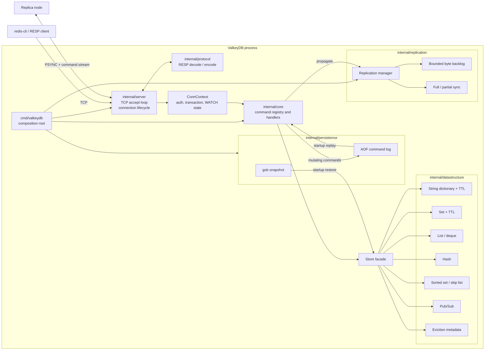
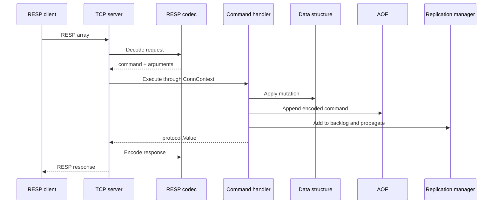

# ValkeyDB

ValkeyDB is an experimental, Redis-inspired in-memory database written from scratch in Go. It implements a focused RESP-compatible command subset together with TTL expiration, configurable key eviction, AOF/RDB-style persistence, transactions, Pub/Sub, and primary-replica replication.

> [!IMPORTANT]
> ValkeyDB is an educational project, not a drop-in Redis/Valkey replacement or a production-ready database. See [Current limitations](#current-limitations) for the known correctness and compatibility gaps.

## Highlights

- RESP request parsing and response encoding compatible with `redis-cli` for the supported command subset
- Concurrent TCP server with per-connection authentication and read/write deadlines
- Strings, sets, lists, hashes, and sorted sets backed by purpose-built Go data structures
- Sorted sets implemented with a hash map and skip list
- Passive and sampled active expiration for strings and sets
- Configurable LRU, LFU, and insertion-order key eviction
- AOF command logging and gob-encoded snapshots
- `MULTI`/`EXEC` transactions with optimistic locking through `WATCH`
- Primary-replica full and partial synchronization with a bounded replication backlog
- Multi-stage, non-root Docker image

## Getting started

Requirements: Go 1.25 or newer and, optionally, `redis-cli`.

```bash
git clone https://github.com/william1nguyen/valkeydb.git
cd valkeydb
make build
make run
```

The default configuration enables authentication. Connect using the password in `config.yaml`:

```bash
redis-cli -p 6379 -a secretpassword
127.0.0.1:6379> PING
PONG
127.0.0.1:6379> SET greeting "hello"
OK
127.0.0.1:6379> GET greeting
"hello"
```

If port `6379` is unavailable, the server automatically tries the next port and logs the selected address.

## Supported commands

| Category | Commands |
| --- | --- |
| String/key | `SET`, `GET`, `DEL`, `EXPIRE`, `PEXPIREAT`, `TTL`, `PING` |
| Set | `SADD`, `SREM`, `SCARD`, `SMEMBERS`, `SISMEMBER`, `SEXPIRE`, `STTL` |
| List | `LPUSH`, `RPUSH`, `LPOP`, `RPOP`, `LLEN`, `LRANGE`, `SORT` |
| Hash | `HSET`, `HGET`, `HDEL`, `HGETALL`, `HEXISTS`, `HLEN` |
| Sorted set | `ZADD`, `ZREM`, `ZSCORE`, `ZRANK`, `ZCARD`, `ZRANGE` |
| Pub/Sub | `SUBSCRIBE`, `UNSUBSCRIBE`, `PUBLISH` |
| Transaction | `MULTI`, `EXEC`, `DISCARD`, `WATCH`, `UNWATCH` |
| Server | `AUTH`, `INFO`, `KEYS`, `MONITOR` |
| Replication | `REPLCONF`, `PSYNC`, `REPLICAOF`, `REPLICATION` |

Command names are intentionally Redis-like, but complete Redis syntax and semantics are not guaranteed. `SEXPIRE`, `STTL`, and `REPLICATION` are ValkeyDB-specific extensions.

## Transactions

ValkeyDB queues commands between `MULTI` and `EXEC`. `WATCH` marks a transaction dirty when another connection mutates a watched key.

```text
127.0.0.1:6379> WATCH balance
OK
127.0.0.1:6379> MULTI
OK
127.0.0.1:6379> SET balance 100
QUEUED
127.0.0.1:6379> EXEC
1) OK
```

If a watched key changes before `EXEC`, the server returns a null array and does not execute the queue.

## Replication

Start the primary normally. It logs an ephemeral API key during startup:

```bash
make run
# Server API key: <api-key>
```

Join a replica with the primary's listening address and API key:

```bash
make replica ADDRESS=localhost:6379 APIKEY=<api-key>
```

The replica attempts a full synchronization on first connection and a backlog-based partial synchronization when possible. It then acknowledges streamed commands and sends heartbeat messages for liveness tracking.

## Configuration

ValkeyDB reads `config.yaml` from its working directory.

```yaml
server:
  addr: ":6379"
  read_timeout: 300
  write_timeout: 300
  auth: secretpassword

replication:
  backlog_size: 1048576
  heartbeat_interval: 1
  heartbeat_timeout: 5

persistence:
  aof:
    enabled: true
    filename: "appendonly.aof"
    rewrite_interval: 3600
    max_size_mb: 64
  rdb:
    enabled: true
    filename: "dump.rdb"

datastructure:
  expiration:
    max_sample_size: 20
    max_sample_rounds: 3
    check_interval: 1

memory:
  key_limit: 5000000
  evict_strategy: "lru"
```

Durations are expressed in seconds. Set `auth` to an empty string to disable client authentication. A missing or non-positive `key_limit` disables key-count-based eviction.

### Eviction policies

| Strategy | Victim selection |
| --- | --- |
| `lru` | Least recently accessed key |
| `lfu` | Key with the lowest access count |
| `evict_first` | Earliest tracked insertion |

## Architecture

### Runtime view



### Write path



The composition root in `cmd/valkeydb` loads configuration, creates the store and persistence engines, restores RDB then AOF state, configures replication, and starts the TCP server. Command handlers are registered through package `init` functions. Each data structure owns its synchronization, while `Store` coordinates cross-cutting concerns such as transactions and eviction.

### Repository layout

```text
valkeydb/
├── cmd/valkeydb/                 # Process entry point and dependency wiring
├── internal/config/              # YAML configuration
├── internal/server/              # TCP server and connection modes
├── internal/protocol/            # RESP value model, decoder, and encoder
├── internal/core/                # Command dispatch, handlers, transactions, metrics
│   └── replication/              # Replication command handlers
├── internal/datastructure/       # In-memory structures, TTL, eviction, Pub/Sub
├── internal/persistence/         # AOF and gob snapshot implementations
├── internal/replication/         # Primary/replica transport, backlog, liveness
├── assets/                       # Documentation assets
├── config.yaml
├── Dockerfile
└── Makefile
```

## Quality checks

```bash
make test
go vet ./...
go test -race ./...
```

The race-enabled suite is expected to pass, including concurrent `WATCH` and write coverage.

## Current limitations

- A key is not represented by one globally typed value, so Redis `WRONGTYPE` behavior and cross-type replacement are incomplete.
- Persistence and replication do not yet cover every mutating command or sorted sets; they must not be treated as lossless.
- Full replication sync does not yet provide a proven point-in-time consistency boundary under concurrent writes.
- Pub/Sub subscription state is process-global instead of connection-local, and subscribed connections cannot yet process the full Redis Pub/Sub command flow.
- `BGSAVE` snapshot execution and graceful signal-driven shutdown are not implemented end to end.
- RESP decoding needs explicit request-size, nesting-depth, and malformed-frame limits before exposure to untrusted networks.
- Integration, persistence recovery, replication, protocol, server, and fuzz tests are still missing.
- The current Docker runtime needs a writable persistence directory/configuration before AOF and RDB can be enabled under its non-root user.

## Roadmap to production-grade behavior

- [x] Fix all race-detector failures and make `WATCH` state synchronization race-free
- [x] Route normal commands and `EXEC` through one ordering boundary so transaction batches cannot interleave with other clients
- [ ] Introduce a single typed keyspace with consistent `DEL`, TTL, eviction, versioning, and `WRONGTYPE` semantics
- [ ] Centralize command metadata so write classification, validation, AOF, and replication cannot drift
- [ ] Make all mutations durable and ordered, including list pops, sorted sets, expiration, and eviction
- [ ] Add atomic snapshot/rewrite boundaries and crash-safe temp-file replacement with error propagation
- [ ] Make replication ordered and gap-free during full sync; test reconnect and backlog rollover
- [ ] Move Pub/Sub state into `ConnContext` and support commands while subscribed
- [ ] Add graceful shutdown, cancellation for background goroutines, and configuration validation
- [ ] Add protocol limits, safer authentication handling, structured logging, and secret redaction
- [ ] Add table-driven unit tests, TCP integration tests, restart/recovery tests, replication tests, fuzzing, benchmarks, and CI quality gates
- [ ] Document the exact compatibility matrix and behavioral differences from Redis/Valkey
- [ ] Add cluster mode only after single-node durability and replication invariants are proven

## Docker

Build the image with:

```bash
docker build -t valkeydb:latest .
```

The image runs as a non-root user. Before enabling AOF/RDB in a container, configure their filenames under a mounted writable directory; this wiring is still part of the roadmap.

## License

See [LICENSE](LICENSE).
