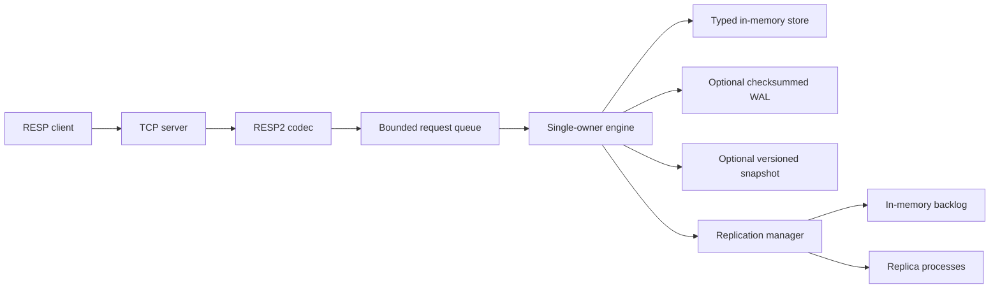
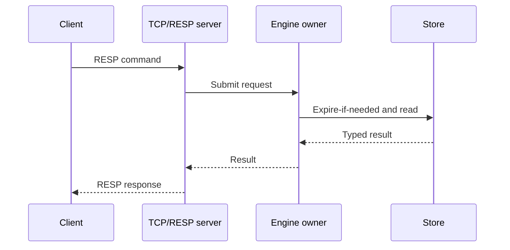
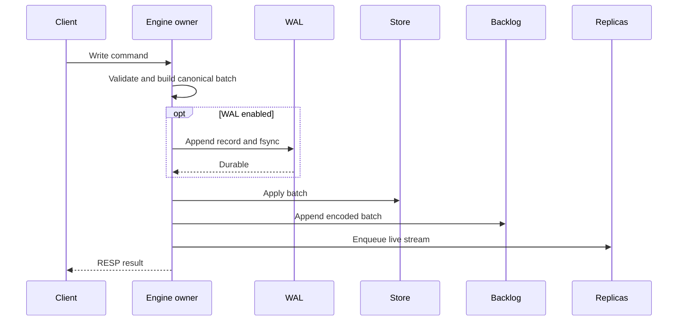
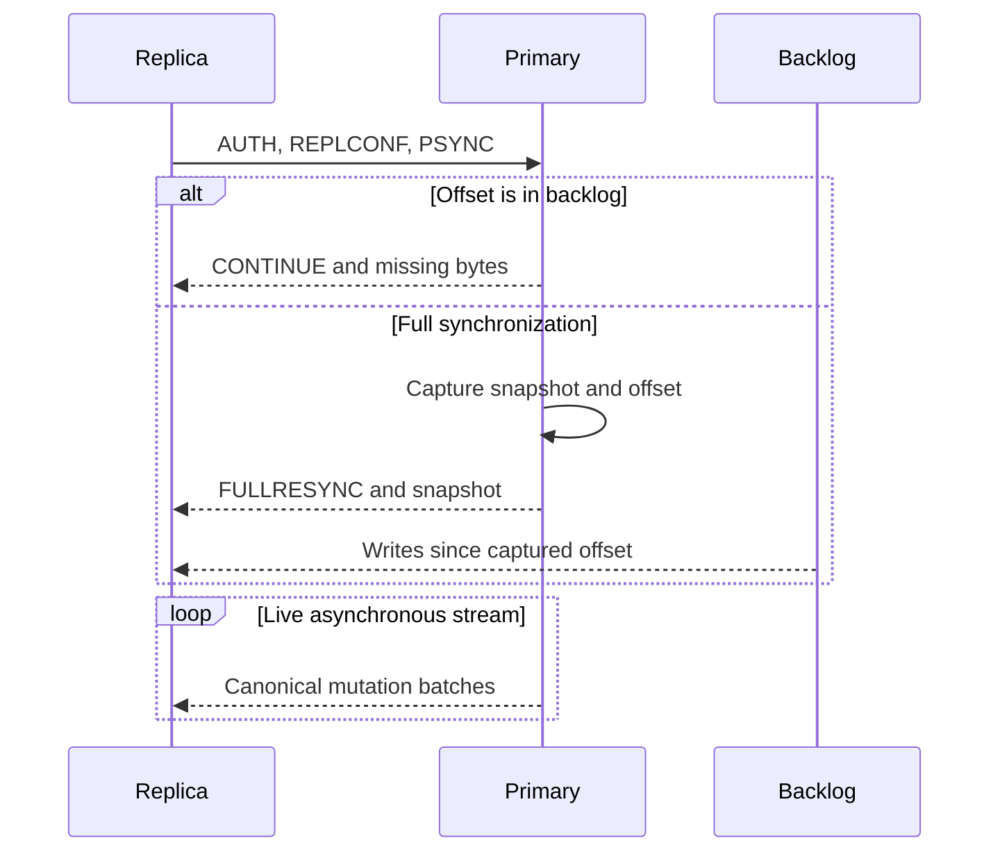

# MemKV

MemKV is an in-memory key-value store written in Go. It uses a single-owner execution model to order concurrent requests and coordinate typed state, optional persistence, TTL expiration, optimistic transactions, and asynchronous replication.

Its wire protocol is a bounded RESP2 subset covering simple strings, errors, integers, bulk strings, and arrays.

## Architecture



### Single-Owner Execution Model

Each client connection has its own TCP goroutine for RESP decoding and response encoding. Parsed commands enter a bounded queue. One engine goroutine owns command execution and orders writes, reads, transactions, expiration maintenance, snapshots, and replication snapshot capture.

The store does not require locks on its command path because it has one runtime owner. This is a single-owner execution model, not a single OS thread: networking, WAL coordination, and replication I/O still run concurrently. A slow command delays commands behind it, and a full request queue applies backpressure to client goroutines.

### Storage Model

Every key maps to one union `Entry` containing its type, payload, version, and absolute expiration deadline. Mutation invariants live in the store: a successful change advances the key version, maintains FIFO capacity metadata, removes empty collections, and notifies the engine so `WATCH` can detect conflicts.

| Type       | Implementation                                  |
| ---------- | ----------------------------------------------- |
| String     | Scalar value                                    |
| Set        | Hash set                                        |
| List       | Growable circular deque                         |
| Hash       | Field-value hash map                            |
| Sorted set | Score map plus deterministic sorted slice       |

Sorted-set mutation rebuilds a sorted slice and runs in `O(n log n)`. This favors deterministic ordering and implementation clarity over large-cardinality write performance.

TTL is stored as an absolute timestamp. Keys expire lazily on access and actively in bounded maintenance batches. `SET EX/PX` is converted to an absolute `PXAT` mutation before persistence and replication.

Optional `memory.max_keys` uses deterministic FIFO eviction. Creating a key beyond the limit commits the write and `DEL` of the oldest key in one canonical mutation batch. Reads and updates do not change FIFO order.

### Durability and Replication

When enabled, WAL records are versioned, length-bounded, checksummed, and synchronized before memory is changed. If WAL append or sync fails, the mutation is not applied and later writes are rejected. On startup, an incomplete final record is truncated; corruption in the middle of the log fails recovery instead of being skipped.

Disk snapshots use a versioned and checksummed `.mksp` format. A checkpoint stores the corresponding WAL byte offset, so recovery restores the snapshot and replays only the committed WAL suffix. Disk snapshots are currently written during graceful shutdown, not periodically.

Replication is asynchronous. A primary write is acknowledged without waiting for a replica. The primary captures a logical snapshot and its replication offset for full synchronization; writes committed during transfer are handed off through the backlog without a snapshot-to-live gap. A reconnect within the backlog window uses partial synchronization. Slow replicas never block the engine: overflowing their bounded queue disconnects them.

Replicas are independent processes configured with a primary address. They intentionally disable local WAL and disk snapshots, do not support promotion, and full-sync again after process restart.

### Supported Commands

| Category     | Commands                                                        |
| ------------ | --------------------------------------------------------------- |
| String/TTL   | `SET`, `GET`, `DEL`, `EXPIRE`, `PEXPIREAT`, `TTL`               |
| Set          | `SADD`, `SREM`, `SMEMBERS`, `SISMEMBER`, `SCARD`                |
| List         | `LPUSH`, `RPUSH`, `LPOP`, `RPOP`, `LLEN`, `LRANGE`              |
| Hash         | `HSET`, `HGET`, `HDEL`, `HGETALL`, `HEXISTS`, `HLEN`            |
| Sorted set   | `ZADD`, `ZREM`, `ZSCORE`, `ZRANK`, `ZCARD`, `ZRANGE`            |
| Transaction  | `MULTI`, `EXEC`, `DISCARD`, `WATCH`, `UNWATCH`                  |
| Server       | `PING`, `AUTH`, `INFO`, `KEYS`, `FLUSHDB`, `FLUSHALL`           |

ACL users, scripting, pub/sub, clustering, sharding, replica promotion, and commands outside the table are not implemented.

## Data Flow

### Read Flow



Reads are ordered with writes by the same engine loop. Access first performs lazy expiration and type checking, then returns a RESP result. A wrong-type access returns an error instead of reading stale payload from another data structure.

### Committed Write Flow



When WAL is enabled, its sync is the durability commit point: memory application and replication propagation happen only after it succeeds. With WAL disabled, the validated batch is applied directly to memory. Because the engine does not interleave another command inside a handler, clients cannot observe the write halfway through its batch. A client timeout after a durable commit is an ambiguous result: recovery may contain a write whose response the client did not receive.

`MULTI` queues validated commands. `EXEC` runs them against a cloned store and commits the resulting canonical mutations as one atomic batch before swapping the planned state into the live store. When WAL is enabled, that batch is stored as one record. `WATCH` aborts before execution when a watched key version changed.

### Replication Flow



## Getting Started

### Installation

Requirements:

- Go 1.25 or newer.
- Make.
- A RESP2 CLI such as `redis-cli` is optional but convenient for manual testing.

```bash
git clone https://github.com/william1nguyen/memkv.git
cd memkv
make build
```

The binary is written to `bin/memkv`.

### Configuration

MemKV loads a YAML file with strict unknown-field rejection:

```yaml
server:
  addr: ":6379"
  read_timeout: 300
  write_timeout: 300
  auth: secretpassword
  resp:
    max_bulk_length: 16777216
    max_array_length: 1024
    max_depth: 8
    max_line_length: 65536

replication:
  role: primary
  primary_addr: ""
  username: ""
  password: ""
  backlog_size: 1048576

persistence:
  wal:
    enabled: true
    filename: memkv.wal
    rewrite_interval: 3600
    max_size_mb: 64
  snapshot:
    enabled: false
    filename: dump.mksp

datastructure:
  expiration:
    check_interval: 1

memory:
  max_keys: 5000000
```

Timeouts, rewrite intervals, and expiration intervals are in seconds; backlog size and RESP limits are in bytes/counts. Omit `memory.max_keys` for unlimited capacity.

For a replica, set `role: replica`, provide `primary_addr` and the primary authentication credentials, and disable both WAL and disk snapshot persistence. Only an empty username or `default` is supported.

When WAL and disk snapshots are enabled together, automatic WAL rewrite is disabled so a stored snapshot offset continues to reference the same log history.

### Running MemKV

Start a primary with `config.yaml`:

```bash
make run
```

Connect using the password from `server.auth`:

```bash
redis-cli -p 6379 -a secretpassword --no-auth-warning
```

```text
127.0.0.1:6379> PING
PONG
127.0.0.1:6379> SET greeting hello
OK
127.0.0.1:6379> GET greeting
"hello"
```

Use another primary configuration:

```bash
make run CONFIG=path/to/primary.yaml
```

Start the sample replica on port `6380`:

```bash
make replica
redis-cli -p 6380 -a secretpassword --no-auth-warning GET greeting
```

Each additional replica needs its own config and unique `server.addr`:

```bash
make replica REPLICA_CONFIG=path/to/replica.yaml
```

### Testing

Run the complete unit and integration suite:

```bash
make test
go test -race -count=1 ./...
go vet ./...
golangci-lint run
```

Run the existing fuzz targets:

```bash
go test -run '^$' -fuzz FuzzDecode -fuzztime 30s ./internal/resp
go test -run '^$' -fuzz FuzzDecodeRecord -fuzztime 30s ./internal/wal
go test -run '^$' -fuzz FuzzDecode -fuzztime 30s ./internal/snapshot
go test -run '^$' -fuzz FuzzParseCommand -fuzztime 30s ./internal/server
```

The suite covers model-based deque and sorted-set behavior, engine ordering, transactions and WATCH conflicts, real TCP fragmentation and pipelining, WAL corruption and tail repair, snapshot replacement failures, replication full/partial synchronization, sync-to-live handoff, and slow-replica overflow.

### Benchmarking

Run the reproducible microbenchmark baseline:

```bash
make bench
```

Override repetition count and benchmark duration when comparing changes:

```bash
BENCH_COUNT=5 BENCH_TIME=2s make bench
```

The script records commit SHA, Go version, OS, and architecture, then reports `ns/op`, `B/op`, and `allocs/op` for RESP, deque, sorted set, store GET/SET/snapshot, WAL record encoding, snapshot encoding, and single-connection server GET/SET round trips.

The following results are the median of three 500 ms runs captured on August 2, 2026:

| Benchmark                    | Time/op    | Bytes/op  | Allocs/op |
| ---------------------------- | ---------- | --------- | --------- |
| RESP encode                  | 197.1 ns   | 152 B       | 8         |
| RESP decode                  | 961.0 ns   | 4,536 B     | 16        |
| Deque push/pop               | 5.297 ns   | 0 B         | 0         |
| Deque growth                 | 7.608 µs   | 16,320 B    | 8         |
| Store string GET             | 15.04 ns   | 0 B         | 0         |
| Store string SET             | 87.95 ns   | 96 B        | 1         |
| Store snapshot, 10k keys     | 2.298 ms   | 3,089,634 B | 154       |
| Sorted-set add, 100 members  | 7.187 µs   | 2,784 B     | 4         |
| Sorted-set add, 1k members   | 105.9 µs   | 24,672 B    | 4         |
| Sorted-set add, 10k members  | 1.343 ms   | 245,857 B   | 4         |
| WAL record codec             | 508.6 ns   | 560 B       | 25        |
| Snapshot encode, 10k keys    | 2.716 ms   | 3,208,996 B | 40,068    |
| Server GET round trip        | 3.904 µs   | 760 B       | 23        |
| Server SET round trip        | 4.036 µs   | 1,032 B     | 26        |

Environment: Go 1.26.4, darwin/arm64, Apple M1 Pro, `BENCH_COUNT=3`, and `BENCH_TIME=500ms`.

The measurements expose two immediate optimization targets: snapshot encoding performs roughly 40k allocations for 10k keys, while RESP decoding allocates about 4.5 KiB per operation. Sorted-set mutation cost also grows quickly with cardinality because it rebuilds the sorted slice.

These are microbenchmarks, not a high-load throughput or tail-latency claim. Multi-connection workloads and p50/p95/p99 latency reporting are outside this baseline.
